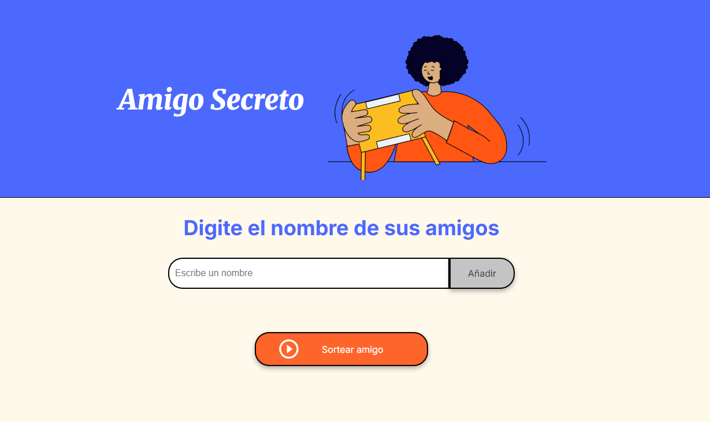
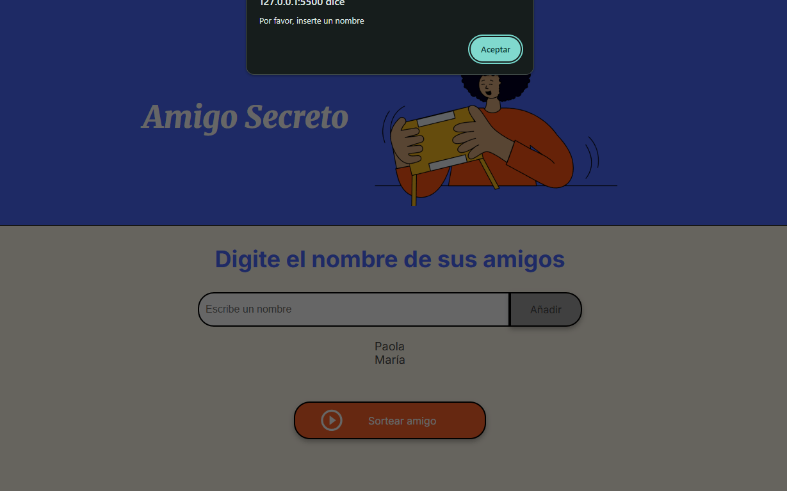
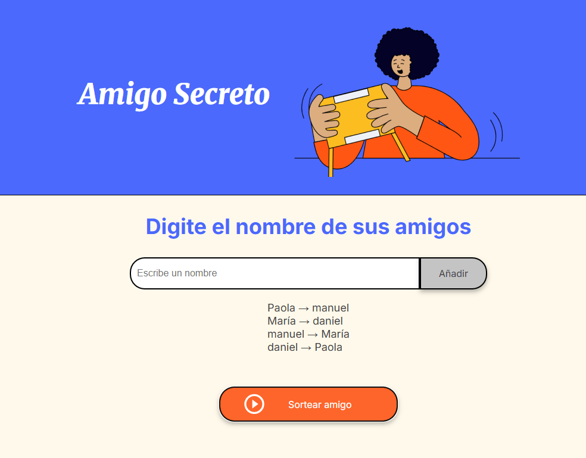

# 🎁 Amigo Secreto

Aplicación web sencilla para organizar un sorteo de **Amigo Secreto**, donde los participantes ingresan sus nombres y el sistema asigna aleatoriamente a cada uno su amigo secreto.

Proyecto en JavaScript que permite:
- Agregar nombres de amigos a una lista.
- Si no se ingresa un nombre válido, se dispara una alerta.
- Mostrar la lista en pantalla.
- Sortear aleatoriamente un "amigo secreto".
- Mostrar el resultado en la página.

## 🖼 Capturas de pantalla

### Pantalla principal

### Ingreso erróneo

### Resultado del sorteo

